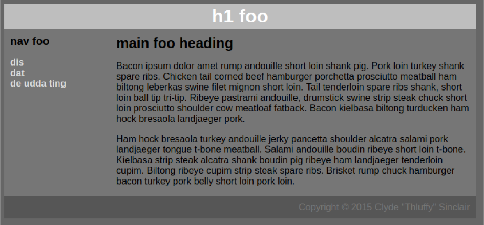
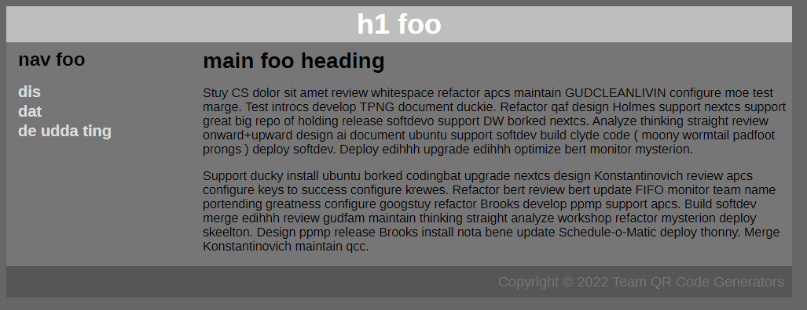

```
TEAM QR Code Generators: William Vongphanith, Jeffrey Zou, Julia Lee
Softdev
K13: Stuylin' & Wylin' & Profilin'
2022-10-18
Time spent: 1 hour
```
## Target


## Our recreation


## How we did it
1. We put together all the text content from the screenshot (minus the lorem ipsum) into our HTML file.
2. Made provisionary classes in the HTML file
3. Wrote CSS classes to style the HTML file
4. Realized the website was in Liberation Sans, so we had to import that font
5. Imported fonts
6. Redo lorem ipsum

## Lorem Ipsum generator
We used [StuyCS Ipsum](https://stuycs-ipsum.williamvongphanith.com/) to generate the lorem ipsum text. We highly recommend it.